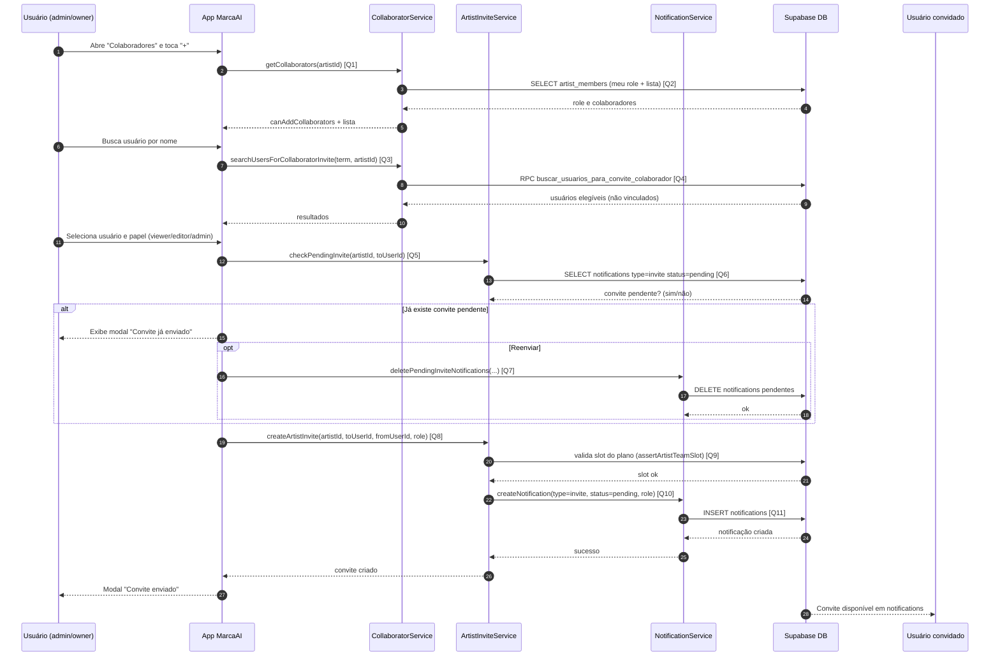

# Diagrama de Sequência - Adicionar Colaborador

Este documento descreve o fluxo de adicionar colaborador no artista, com foco no caminho por **convite** (usado na tela de colaboradores), incluindo busca, validação de convite pendente e criação da notificação.

## Diagrama de Sequência

## Links das Queries/Chamadas

- **[Q1] Carregar colaboradores e permissões na tela**: [`services/supabase/collaboratorService.ts`](../services/supabase/collaboratorService.ts)
- **[Q2] Consultas em `artist_members` (role e lista de membros)**: [`services/supabase/collaboratorService.ts`](../services/supabase/collaboratorService.ts)
- **[Q3] Busca de usuários para convite**: [`services/supabase/collaboratorService.ts`](../services/supabase/collaboratorService.ts)
- **[Q4] RPC de busca (`buscar_usuarios_para_convite_colaborador`)**: [`database/BUSCAR_USUARIOS_COLABORADOR.sql`](../database/BUSCAR_USUARIOS_COLABORADOR.sql)
- **[Q5] Verificação de convite pendente**: [`services/supabase/artistInviteService.ts`](../services/supabase/artistInviteService.ts)
- **[Q6] Consulta na tabela `notifications` para convites pendentes**: [`services/supabase/artistInviteService.ts`](../services/supabase/artistInviteService.ts)
- **[Q7] Limpeza de convites pendentes para reenviar**: [`services/supabase/notificationService.ts`](../services/supabase/notificationService.ts)
- **[Q8] Criação de convite de artista**: [`services/supabase/artistInviteService.ts`](../services/supabase/artistInviteService.ts)
- **[Q9] Validação de limite de plano (`assertArtistTeamSlot`)**: [`services/supabase/userService.ts`](../services/supabase/userService.ts)
- **[Q10] Criação de notificação de convite**: [`services/supabase/artistInviteService.ts`](../services/supabase/artistInviteService.ts)
- **[Q11] INSERT em `notifications` (`createNotification`)**: [`services/supabase/notificationService.ts`](../services/supabase/notificationService.ts)

## Regras Importantes

- Só `owner` e `admin` podem convidar/adicionar colaboradores.
- A tela evita convite duplicado verificando `notifications` com `status = pending`.
- Convite é persistido como notificação do tipo `invite` (não depende de `artist_invites` neste fluxo).
- O papel `owner` é normalizado para `admin` ao criar novo convite direto na tela.
- O limite do plano gratuito é validado antes de enviar convite.

