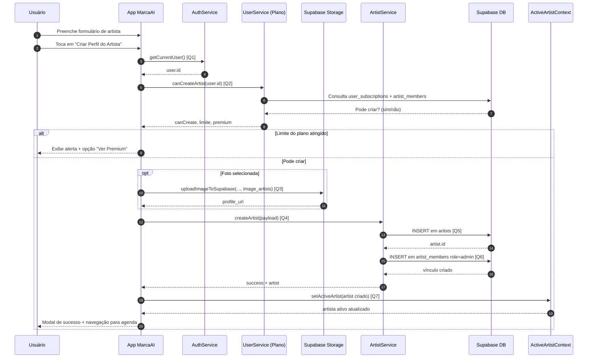

# Diagrama de Sequência - Criação de Artista

Este documento descreve o fluxo de criação de perfil de artista no app, incluindo validação de limite do plano, upload de imagem, criação no Supabase e definição do artista ativo.

## Diagrama de Sequência

## Links das Queries/Chamadas

- **[Q1] Usuário atual autenticado**: [`services/supabase/authService.ts`](../services/supabase/authService.ts)
- **[Q2] Verificação de limite/plano para criar artista (`canCreateArtist`)**: [`services/supabase/userService.ts`](../services/supabase/userService.ts)
- **[Q3] Upload da imagem do artista (bucket `image_artists`)**: [`services/supabase/imageUploadService.ts`](../services/supabase/imageUploadService.ts)
- **[Q4] Chamada de criação (`createArtist`)**: [`services/supabase/artistService.ts`](../services/supabase/artistService.ts)
- **[Q5] INSERT na tabela `artists`**: [`services/supabase/artistService.ts`](../services/supabase/artistService.ts)
- **[Q6] INSERT na tabela `artist_members` com papel `admin`**: [`services/supabase/artistService.ts`](../services/supabase/artistService.ts)
- **[Q7] Definição do artista ativo no contexto**: [`app/screens/profile/ArtistProfileScreen.tsx`](../app/screens/profile/ArtistProfileScreen.tsx)

## Regras Importantes

- O criador do artista entra automaticamente como `admin` em `artist_members`.
- Se falhar a criação de `artist_members`, o código remove o artista recém-criado para evitar inconsistência.
- O limite de criação no plano gratuito é validado antes de tentar inserir no banco.
- Após sucesso, o novo artista vira o artista ativo da sessão.

