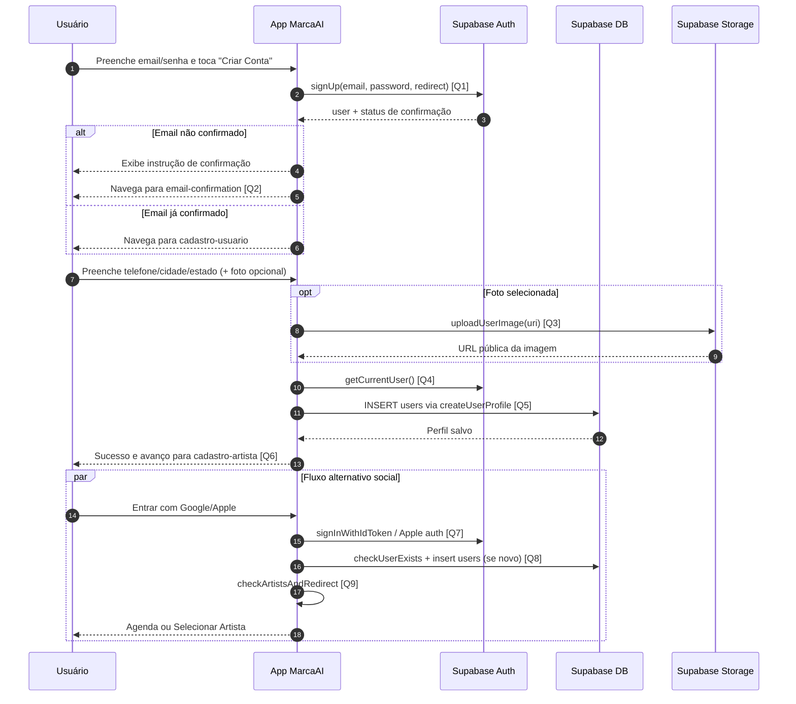

# Diagrama de Sequência - Criação de Conta

Este documento descreve o fluxo de criação de conta no app, cobrindo:

- cadastro por **email e senha**
- cadastro/login social (**Google** e **Apple**)
- finalização de perfil em `cadastro-usuario`

## Diagrama de Sequência

## Links das Queries/Chamadas

- **[Q1] Cadastro email/senha (`supabase.auth.signUp`)**: [`app/register.tsx`](../app/register.tsx)
- **[Q2] Reenvio/fluxo de confirmação (`resend signup`)**: [`services/supabase/authService.ts`](../services/supabase/authService.ts)
- **[Q3] Upload de imagem de perfil**: [`services/supabase/imageUploadService.ts`](../services/supabase/imageUploadService.ts)
- **[Q4] Usuário autenticado atual (`getCurrentUser`)**: [`services/supabase/authService.ts`](../services/supabase/authService.ts)
- **[Q5] Criação de perfil (`INSERT` em `users`)**: [`services/supabase/userService.ts`](../services/supabase/userService.ts)
- **[Q6] Tela de finalização do perfil (`cadastro-usuario`)**: [`app/screens/profile/UserProfileScreen.tsx`](../app/screens/profile/UserProfileScreen.tsx)
- **[Q7] Login/cadastro social (Google/Apple)**: [`app/register.tsx`](../app/register.tsx)
- **[Q8] Upsert social em `users` (`checkUserExists` + insert)**: [`services/supabase/userService.ts`](../services/supabase/userService.ts)
- **[Q9] Redirecionamento pós-login por artistas**: [`services/supabase/authService.ts`](../services/supabase/authService.ts)

## Regras Importantes

- No cadastro por email, o usuário pode precisar confirmar o email antes de avançar.
- O perfil em `users` é concluído em `cadastro-usuario` (telefone/cidade/estado obrigatórios).
- Em login social, se o usuário já existir na tabela `users`, os dados não são sobrescritos automaticamente.
- O redirecionamento final depende da quantidade de artistas vinculados ao usuário.

