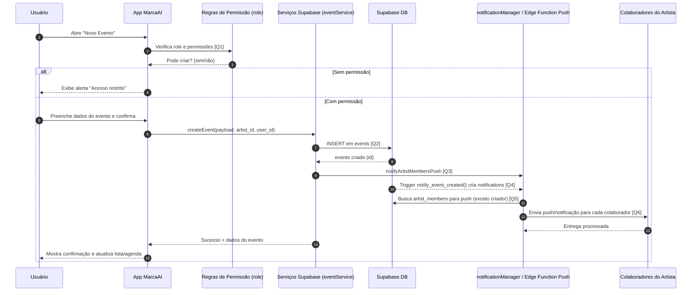

# Diagrama de Sequência - Criação de Evento

Este documento descreve o fluxo de criação de evento no app, incluindo validação de permissão, persistência no Supabase e notificação de colaboradores.

## Visão Geral

- O usuário abre a tela de novo evento.
- O app valida permissões por papel (role) no artista ativo.
- Se permitido, cria o evento no backend.
- Após criar, dispara notificações para colaboradores elegíveis (exceto o criador).
- O app atualiza a interface com o evento criado.

## Diagrama de Sequência

## Links das Queries Chamadas

- **[Q1] Permissões do usuário no artista (`artist_members.role`)**: [`services/supabase/permissionsService.ts`](../services/supabase/permissionsService.ts)
- **[Q2] Criação do evento (`INSERT` em `events`)**: [`services/supabase/eventService.ts`](../services/supabase/eventService.ts)
- **[Q3] Disparo de push após criar evento (`notifyArtistMembersPush`)**: [`services/supabase/eventService.ts`](../services/supabase/eventService.ts)
- **[Q4] Notificação em tabela por trigger SQL (`notify_event_created`)**: [`corrigir-trigger-evento.sql`](../corrigir-trigger-evento.sql)
- **[Q5] Consulta de colaboradores para notificação (`artist_members`)**: [`services/notificationManager.ts`](../services/notificationManager.ts)
- **[Q6] Criação de notificação para usuários (`notifications`)**: [`services/supabase/notificationService.ts`](../services/supabase/notificationService.ts)

## Regras Importantes

- Apenas perfis com permissão podem criar evento.
- O criador do evento não recebe notificação de "novo evento".
- O evento é persistido antes do envio das notificações.
- Em caso de falha de notificação, o evento pode continuar criado (dependendo do tratamento do serviço).

## Resultado Esperado

- Evento salvo com sucesso no Supabase.
- Colaboradores do artista recebem aviso de criação/atualização.
- Tela reflete o novo evento sem inconsistências de permissão.

