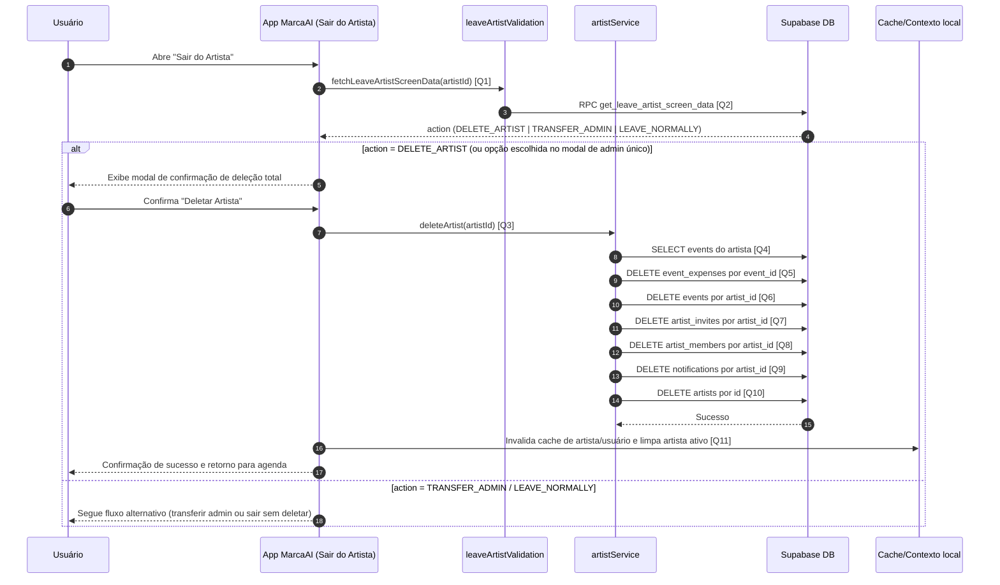

# Diagrama de Sequência - Deletar Artista

Este documento descreve o fluxo de deleção de artista no app, incluindo validação de cenário na tela "Sair do Artista" e remoção em cascata dos dados vinculados.

## Visão Geral

- O usuário abre a tela de saída/remoção do artista.
- O app consulta uma validação para decidir a ação permitida.
- No cenário de deleção, o usuário confirma em modal de risco.
- O serviço remove dados vinculados e, por fim, o registro do artista.
- O app limpa cache/contexto e volta para a agenda.

## Diagrama de Sequência

## Links das Queries/Chamadas

- **[Q1] Carregamento de validação da tela "Sair do Artista"**: [`services/supabase/leaveArtistValidation.ts`](../services/supabase/leaveArtistValidation.ts)
- **[Q2] RPC de decisão de ação (`get_leave_artist_screen_data`)**: [`services/supabase/leaveArtistValidation.ts`](../services/supabase/leaveArtistValidation.ts)
- **[Q3] Função de deleção completa do artista**: [`services/supabase/artistService.ts`](../services/supabase/artistService.ts)
- **[Q4] Busca de eventos vinculados ao artista**: [`services/supabase/artistService.ts`](../services/supabase/artistService.ts)
- **[Q5] Remoção de despesas (`event_expenses`)**: [`services/supabase/artistService.ts`](../services/supabase/artistService.ts)
- **[Q6] Remoção de eventos (`events`)**: [`services/supabase/artistService.ts`](../services/supabase/artistService.ts)
- **[Q7] Remoção de convites (`artist_invites`)**: [`services/supabase/artistService.ts`](../services/supabase/artistService.ts)
- **[Q8] Remoção de colaboradores (`artist_members`)**: [`services/supabase/artistService.ts`](../services/supabase/artistService.ts)
- **[Q9] Remoção de notificações (`notifications`)**: [`services/supabase/artistService.ts`](../services/supabase/artistService.ts)
- **[Q10] Remoção final do artista (`artists`)**: [`services/supabase/artistService.ts`](../services/supabase/artistService.ts)
- **[Q11] Limpeza de cache/contexto e navegação pós-sucesso**: [`app/sair-artista.tsx`](../app/sair-artista.tsx)

## Regras Importantes

- O app depende da validação para decidir se o usuário pode sair normalmente ou precisa transferir/deletar.
- A deleção de artista remove dados operacionais e financeiros associados.
- Em caso de erro intermediário na cadeia de deleção, o serviço retorna erro e o app não finaliza o fluxo local.
- Após sucesso, o artista ativo precisa ser limpo no contexto para evitar estado inconsistente.

## Resultado Esperado

- Artista e dados vinculados removidos do Supabase.
- Usuário não mantém contexto ativo do artista removido.
- Navegação retorna para a agenda com feedback de sucesso.

