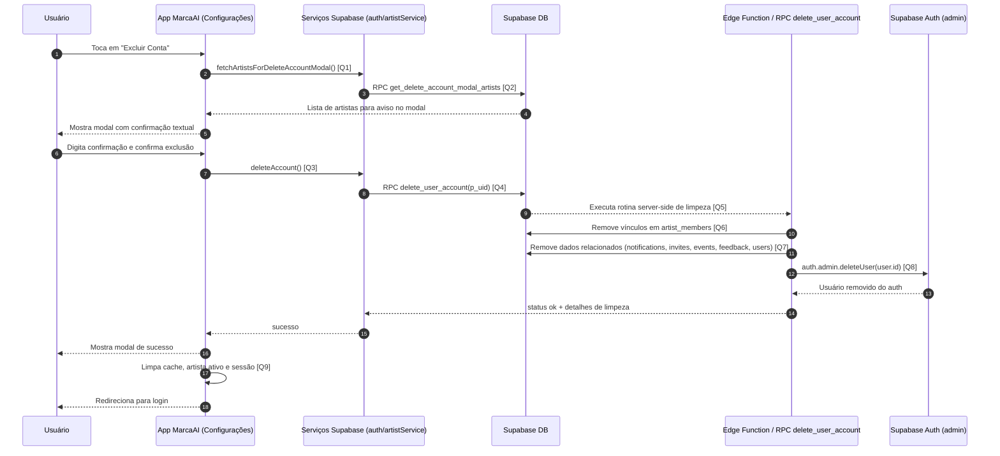

# Diagrama de Sequência - Deletar Usuário

Este documento descreve o fluxo de exclusão de conta do usuário no app, desde a confirmação na UI até a limpeza de dados no Supabase e remoção em `auth.users`.

## Visão Geral

- O usuário inicia a ação de excluir conta em Configurações.
- O app carrega os artistas vinculados para exibir no modal de confirmação.
- Após confirmação textual, o app chama a rotina de deleção de conta.
- O backend remove vínculos, dados relacionados e a conta de autenticação.
- O app encerra a sessão local e redireciona para login.

## Diagrama de Sequência

## Links das Queries/Chamadas

- **[Q1] Carregar artistas para modal de exclusão**: [`services/supabase/artistService.ts`](../services/supabase/artistService.ts)
- **[Q2] RPC de apoio ao modal (`get_delete_account_modal_artists`)**: [`services/supabase/artistService.ts`](../services/supabase/artistService.ts)
- **[Q3] Ação de exclusão de conta na camada de auth**: [`services/supabase/authService.ts`](../services/supabase/authService.ts)
- **[Q4] Chamada RPC de exclusão (`delete_user_account`)**: [`services/supabase/authService.ts`](../services/supabase/authService.ts)
- **[Q5] Implementação server-side da exclusão da conta**: [`supabase/functions/delete_user_account/index.ts`](../supabase/functions/delete_user_account/index.ts)
- **[Q6] Remoção de memberships e tratamento de artistas administrados**: [`supabase/functions/delete_user_account/index.ts`](../supabase/functions/delete_user_account/index.ts)
- **[Q7] Limpeza de dados relacionados do usuário**: [`supabase/functions/delete_user_account/index.ts`](../supabase/functions/delete_user_account/index.ts)
- **[Q8] Exclusão do usuário em `auth.users` (admin API)**: [`supabase/functions/delete_user_account/index.ts`](../supabase/functions/delete_user_account/index.ts)
- **[Q9] Limpeza de sessão e redirecionamento pós-exclusão**: [`app/(tabs)/configuracoes.tsx`](../app/(tabs)/configuracoes.tsx)

## Regras Importantes

- A confirmação textual deve bater com o valor solicitado no modal.
- A exclusão de conta é irreversível.
- Se o usuário for admin de artistas, o backend remove vínculo ou deleta artista conforme cenário de administração.
- O app só finaliza o fluxo local (logout/reset) após receber sucesso da exclusão.

## Resultado Esperado

- Conta removida de `auth.users`.
- Perfil e dados relacionados removidos do banco.
- Sessão local encerrada e usuário redirecionado para a tela de login.

