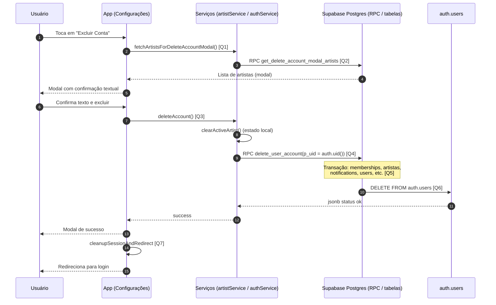

# Diagrama de Sequência — Deletar Usuário

Este documento descreve o fluxo de exclusão de conta no app, da confirmação na UI até a limpeza no Postgres e remoção em `auth.users`.

## Visão Geral

- O usuário inicia a exclusão em **Configurações**.
- O app carrega os artistas vinculados via **RPC** para o texto de aviso no modal.
- Após confirmação textual, o app chama **`deleteAccount`**, que executa a **RPC `delete_user_account`** no banco (função `SECURITY DEFINER` em transação).
- A função SQL remove vínculos, dados relacionados e, por fim, a linha em **`auth.users`**.
- Em sucesso, o app limpa sessão/cache e redireciona para login.

> **Nota:** o app chama a RPC diretamente pelo cliente Supabase. A implementação canônica da lógica está em [`database/delete_user_account.sql`](../database/delete_user_account.sql). Existe também implementação em [`supabase/functions/delete_user_account/`](../supabase/functions/delete_user_account/) para uso server-side, se o projeto invocar por Edge.

## Diagrama de Sequência

## Links das Queries / Chamadas

- **[Q1] Abrir fluxo e carregar artistas para o modal**: [`app/(tabs)/configuracoes.tsx`](../app/(tabs)/configuracoes.tsx) — `handleDeleteAccount` (~388)
- **[Q2] RPC `get_delete_account_modal_artists`**: [`services/supabase/artistService.ts`](../services/supabase/artistService.ts) — `fetchArtistsForDeleteAccountModal` (~160)
- **[Q3] Orquestração da exclusão (sessão + RPC)**: [`services/supabase/authService.ts`](../services/supabase/authService.ts) — `deleteAccount` (~213)
- **[Q4] Chamada `supabase.rpc('delete_user_account')`**: [`services/supabase/authService.ts`](../services/supabase/authService.ts) (~224)
- **[Q5] Definição da RPC e passos de limpeza**: [`database/delete_user_account.sql`](../database/delete_user_account.sql)
- **[Q6] Remoção em `auth.users` (dentro da mesma função)**: [`database/delete_user_account.sql`](../database/delete_user_account.sql) — passo final (~145)
- **[Q7] Limpeza de sessão e redirecionamento**: [`app/(tabs)/configuracoes.tsx`](../app/(tabs)/configuracoes.tsx) — `handleCloseDeleteSuccessModal` / `cleanupSessionAndRedirect` (~449)

## Regras Importantes

- A confirmação textual deve coincidir com o valor exibido no modal.
- A RPC exige `p_uid = auth.uid()`; UUID forjado retorna erro.
- A exclusão é **irreversível**; falha em `auth.users` reverte a transação inteira (dados públicos não ficam órfãos com login ativo).
- Se o usuário for único gerente (`admin`/`owner`) de um artista, o artista pode ser **apagado**; caso contrário, remove-se apenas a membership.

## Resultado Esperado

- Linha removida de `auth.users` e perfil/dados relacionados em `public`.
- Sessão local encerrada e usuário na tela de login.
