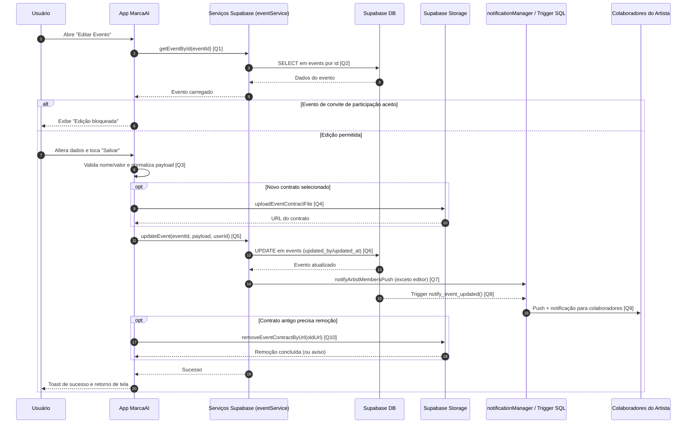

# Diagrama de Sequência - Edição de Evento

Este documento descreve o fluxo de edição de evento no app, incluindo validações na tela, atualização no Supabase e notificações para colaboradores.

## Visão Geral

- O usuário abre a tela de edição de evento.
- O app carrega o evento atual e bloqueia edição em casos especiais (evento vindo de convite aceito).
- Ao salvar, valida campos obrigatórios e normaliza os dados (data/hora/UF/valor).
- O app atualiza o evento no backend e dispara notificações para membros elegíveis.
- A UI retorna para a tela anterior com feedback de sucesso.

## Diagrama de Sequência

## Links das Queries/Chamadas

- **[Q1] Busca do evento para preencher formulário**: [`app/editar-evento.tsx`](../app/editar-evento.tsx)
- **[Q2] Consulta do evento por ID (`SELECT` em `events`)**: [`services/supabase/eventService.ts`](../services/supabase/eventService.ts)
- **[Q3] Validação e montagem do payload de edição**: [`app/editar-evento.tsx`](../app/editar-evento.tsx)
- **[Q4] Upload de contrato do evento**: [`services/supabase/eventContractService.ts`](../services/supabase/eventContractService.ts)
- **[Q5] Chamada de atualização do evento (`updateEvent`)**: [`app/editar-evento.tsx`](../app/editar-evento.tsx)
- **[Q6] Atualização no banco (`UPDATE` em `events`)**: [`services/supabase/eventService.ts`](../services/supabase/eventService.ts)
- **[Q7] Disparo de push após edição (`notifyArtistMembersPush`)**: [`services/supabase/eventService.ts`](../services/supabase/eventService.ts)
- **[Q8] Trigger SQL de notificação na atualização (`notify_event_updated`)**: [`corrigir-trigger-evento.sql`](../corrigir-trigger-evento.sql)
- **[Q9] Criação/entrega de notificações para colaboradores**: [`services/notificationManager.ts`](../services/notificationManager.ts)
- **[Q10] Remoção de contrato antigo do Storage**: [`services/supabase/eventContractService.ts`](../services/supabase/eventContractService.ts)

## Regras Importantes

- Eventos originados de convite de participação aceito não podem ser editados.
- Nome é obrigatório; valor também, exceto no caso de evento de convite de participação.
- `updated_by` e `updated_at` devem ser persistidos no `UPDATE` para rastreabilidade e trigger correto.
- O editor do evento não deve receber a notificação da própria edição.
- Falha na remoção do contrato antigo não invalida a edição já salva do evento.

## Resultado Esperado

- Evento atualizado com os novos dados no Supabase.
- Colaboradores elegíveis recebem aviso de atualização.
- Usuário recebe feedback visual de sucesso e retorno consistente para a agenda/detalhes.

