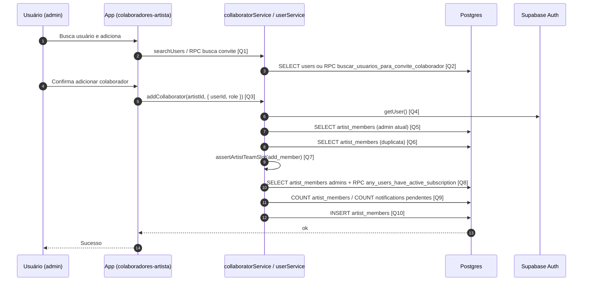

# Diagrama de Sequência — Adicionar Colaborador

Administrador adiciona um usuário existente ao time do artista: validações em **`artist_members`**, limite de time (**`assertArtistTeamSlot`**) e **`INSERT` em `artist_members`**.

## Visão Geral

- Apenas **admin** do artista pode adicionar diretamente.
- Verifica duplicidade (já é membro).
- Valida cota do plano (membros + convites pendentes, conforme modo).
- Inclui nova linha em **`artist_members`** com a `role` escolhida.

## Diagrama de Sequência

## Links das Queries / Chamadas

- **[Q1] UI `handleAddCollaborator`**: [`app/colaboradores-artista.tsx`](../app/colaboradores-artista.tsx) (~419)
- **[Q2] `searchUsers` (`users`)**: [`services/supabase/collaboratorService.ts`](../services/supabase/collaboratorService.ts) (~200) — **RPC** `buscar_usuarios_para_convite_colaborador`: (~166)
- **[Q3] `addCollaborator`**: [`services/supabase/collaboratorService.ts`](../services/supabase/collaboratorService.ts) (~244)
- **[Q4] `supabase.auth.getUser`**: [`services/supabase/collaboratorService.ts`](../services/supabase/collaboratorService.ts) (~247)
- **[Q5] Membership admin**: [`services/supabase/collaboratorService.ts`](../services/supabase/collaboratorService.ts) (~252)
- **[Q6] Verificar duplicata**: [`services/supabase/collaboratorService.ts`](../services/supabase/collaboratorService.ts) (~268)
- **[Q7] `assertArtistTeamSlot`**: [`services/supabase/userService.ts`](../services/supabase/userService.ts) (~511)
- **[Q8] `artistTeamHasPremiumQuota`**: [`services/supabase/userService.ts`](../services/supabase/userService.ts) (~439)
- **[Q9] `getArtistMemberCount` / `countPendingArtistInvites`**: [`services/supabase/userService.ts`](../services/supabase/userService.ts) (~471, ~490)
- **[Q10] `INSERT artist_members`**: [`services/supabase/collaboratorService.ts`](../services/supabase/collaboratorService.ts) (~288)

## Regras Importantes

- Papel do membro atual deve ser **`admin`**.
- Limite do plano gratuito considera membros e convites pendentes (`send_invite` vs `add_member`).

## Resultado Esperado

- Novo registro em `artist_members` ligando `user_id` ao `artist_id` com a role definida.
