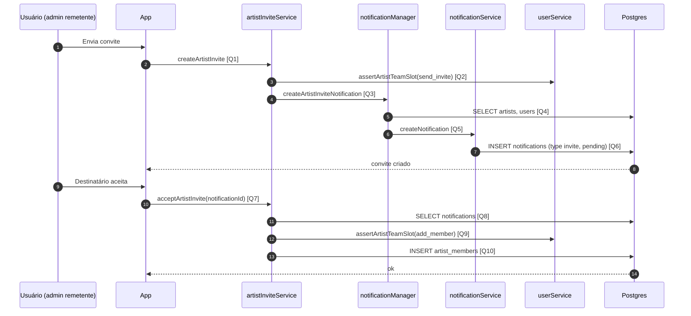

# Diagrama de Sequência — Convite de Colaborador

Convite por **notificação** (`type = invite`) na tabela **`notifications`**; ao aceitar, **`INSERT` em `artist_members`** com a role gravada no convite.

## Visão Geral

- **`createArtistInvite`**: valida vaga (`assertArtistTeamSlot` modo `send_invite`), monta texto e chama **`createNotification`**.
- **`acceptArtistInvite`**: lê notificação pendente, valida vaga (`add_member`), insere em **`artist_members`**; atualização de status da notificação costuma ocorrer na UI/handler relacionado.

## Diagrama de Sequência

## Links das Queries / Chamadas

- **[Q1] `createArtistInvite`**: [`services/supabase/artistInviteService.ts`](../services/supabase/artistInviteService.ts) (~47)
- **[Q2] `assertArtistTeamSlot`**: [`services/supabase/userService.ts`](../services/supabase/userService.ts) (~511)
- **[Q3] `createArtistInviteNotification`**: [`services/notificationManager.ts`](../services/notificationManager.ts) (~5)
- **[Q4] Contexto artista/remetente**: [`services/notificationManager.ts`](../services/notificationManager.ts) (~14)
- **[Q5] `createNotification`**: [`services/supabase/notificationService.ts`](../services/supabase/notificationService.ts) (~41)
- **[Q6] `INSERT notifications`**: [`services/supabase/notificationService.ts`](../services/supabase/notificationService.ts) (~49)
- **[Q7] `acceptArtistInvite`**: [`services/supabase/artistInviteService.ts`](../services/supabase/artistInviteService.ts) (~186)
- **[Q8] `SELECT notifications`**: [`services/supabase/artistInviteService.ts`](../services/supabase/artistInviteService.ts) (~191)
- **[Q9] Slot ao aceitar**: [`services/supabase/artistInviteService.ts`](../services/supabase/artistInviteService.ts) (~207)
- **[Q10] `INSERT artist_members`**: [`services/supabase/artistInviteService.ts`](../services/supabase/artistInviteService.ts) (~218)
- **Convite sem checagem de admin no serviço**: [`services/supabase/collaboratorService.ts`](../services/supabase/collaboratorService.ts) — `addCollaboratorViaInvite` (~509)

## Regras Importantes

- Convite pendente conta na cota ao **enviar** (`send_invite`).
- Ao **aceitar**, valida-se novamente o slot (`add_member`).
- Conflito de unicidade em `artist_members` retorna mensagem amigável (código `23505`).

## Resultado Esperado

- Notificação de convite registrada; após aceite, membro em `artist_members` com a role do convite.
