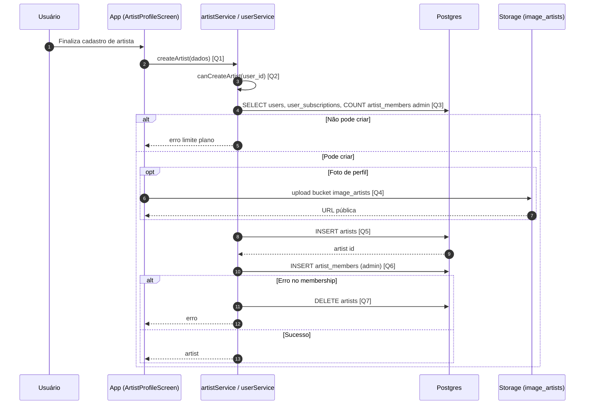

# Diagrama de Sequência — Criar Artista

Criação do perfil **`artists`** e vínculo do criador como **`artist_members`** com papel `admin`, respeitando limites do plano.

## Visão Geral

- O app valida se o usuário pode criar mais artistas como admin (`canCreateArtist`).
- Opcionalmente envia foto ao **Storage** (`image_artists`).
- Insere em **`artists`**; em seguida **`artist_members`**; se o segundo falhar, remove o artista criado (rollback).

## Diagrama de Sequência

## Links das Queries / Chamadas

- **[Q1] `createArtist`**: [`services/supabase/artistService.ts`](../services/supabase/artistService.ts) (~40)
- **[Q2] `canCreateArtist`**: [`services/supabase/userService.ts`](../services/supabase/userService.ts) (~558)
- **[Q3] Consultas internas** (`getUserProfile`, `checkUserSubscriptionFromTable`, count em `artist_members`): [`services/supabase/userService.ts`](../services/supabase/userService.ts)
- **[Q4] Upload de imagem**: [`app/screens/profile/ArtistProfileScreen.tsx`](../app/screens/profile/ArtistProfileScreen.tsx) — `uploadImageToSupabase` (~323)
- **[Q5] `INSERT artists`**: [`services/supabase/artistService.ts`](../services/supabase/artistService.ts) (~63)
- **[Q6] `INSERT artist_members`**: [`services/supabase/artistService.ts`](../services/supabase/artistService.ts) (~89)
- **[Q7] Rollback `DELETE artists`**: [`services/supabase/artistService.ts`](../services/supabase/artistService.ts) (~101)

## Regras Importantes

- No plano gratuito há limite de perfis de artista **como administrador**; premium ignora conforme regra em `canCreateArtist`.
- Campos de disponibilidade para shows só persistem quando `is_available_for_gigs` está ativo.

## Resultado Esperado

- Registro em `artists` e em `artist_members` com `role = admin` para o `user_id` criador.
