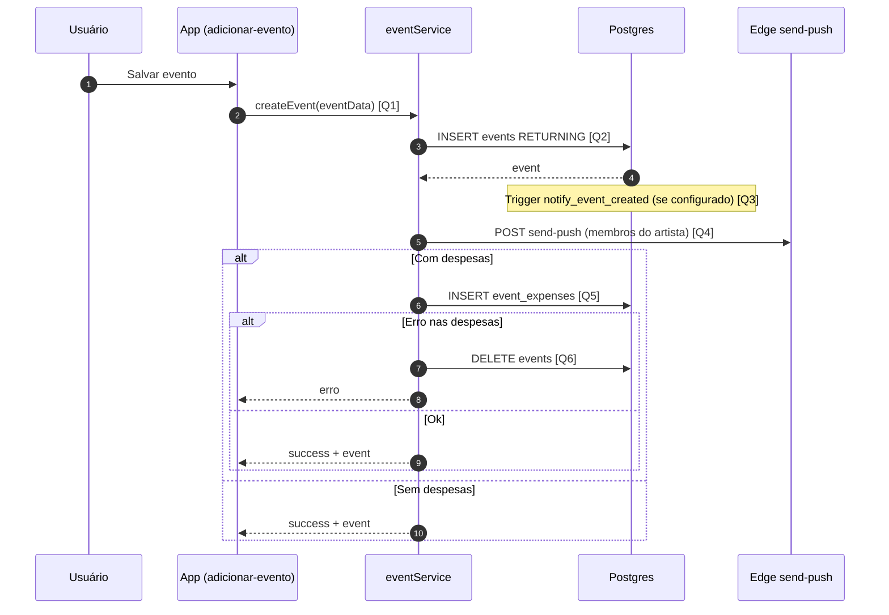
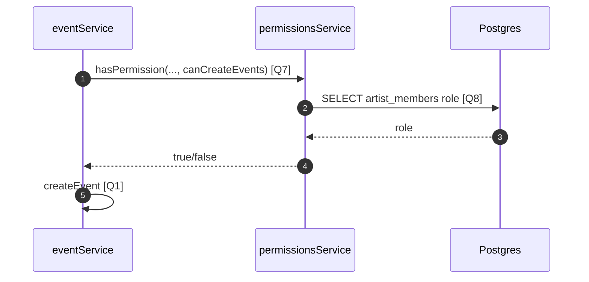

# Diagrama de Sequência — Criar Evento

Criação de **`events`**, despesas opcionais em **`event_expenses`**, notificações via **trigger** no banco (conforme comentário no código) e **push** pela Edge `send-push`.

## Visão Geral

- A tela **Adicionar evento** chama `createEvent` diretamente (sem `createEventWithPermissions` nesse fluxo de UI).
- Insere uma linha em **`events`**; se houver despesas, faz **`INSERT` em `event_expenses`**; em erro nas despesas, **apaga o evento** criado.
- Chama **`notifyArtistMembersPush`** (HTTP para Edge Function).
- Existe caminho alternativo **`createEventWithPermissions`** que consulta **`artist_members`** via `hasPermission` antes de criar.

## Diagrama de Sequência

### Caminho com verificação de permissão (serviço)

## Links das Queries / Chamadas

- **[Q1] `createEvent`**: [`services/supabase/eventService.ts`](../services/supabase/eventService.ts) (~131)
- **[Q2] `INSERT events`**: [`services/supabase/eventService.ts`](../services/supabase/eventService.ts) (~140)
- **[Q3] Triggers SQL (referência)**: [`corrigir-trigger-evento.sql`](../corrigir-trigger-evento.sql) (ajuste/deploy no Supabase)
- **[Q4] `notifyArtistMembersPush`**: [`services/supabase/eventService.ts`](../services/supabase/eventService.ts) (~10, ~179)
- **[Q5] `INSERT event_expenses`**: [`services/supabase/eventService.ts`](../services/supabase/eventService.ts) (~202)
- **[Q6] Rollback `DELETE events`**: [`services/supabase/eventService.ts`](../services/supabase/eventService.ts) (~208)
- **[Q7] `createEventWithPermissions`**: [`services/supabase/eventService.ts`](../services/supabase/eventService.ts) (~479)
- **[Q8] `getUserPermissions` / `artist_members`**: [`services/supabase/permissionsService.ts`](../services/supabase/permissionsService.ts) (~42)
- **UI que chama `createEvent`**: [`app/adicionar-evento.tsx`](../app/adicionar-evento.tsx) (~427)

## Regras Importantes

- Valor `0` de cachê é válido; o payload não deve converter `0` em `null` (comentário no serviço).
- Falha em despesas remove o evento já inserido para manter consistência.

## Resultado Esperado

- Evento persistido; despesas vinculadas quando informadas; colaboradores notificados (DB e/ou push conforme ambiente).
