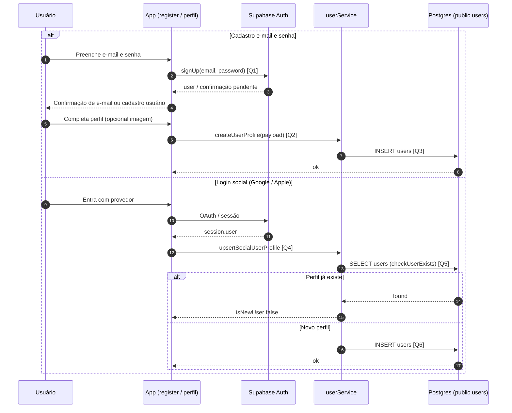

# Diagrama de Sequência — Criar Usuário

Fluxo de cadastro: criação na **autenticação** (e-mail/senha) e, em seguida, perfil na tabela **`users`**. Login social cria a linha em `users` quando ainda não existe.

## Visão Geral

- **E-mail/senha:** `signUp` no Auth; após confirmação (se exigida), o usuário completa dados e o app faz **`INSERT` em `users`**.
- **Google/Apple:** após sessão, o app verifica **`users`**; se não houver perfil, insere um registro mínimo.
- Token FCM pode ser anexado na criação do perfil.

## Diagrama de Sequência

## Links das Queries / Chamadas

- **[Q1] `supabase.auth.signUp`**: [`app/register.tsx`](../app/register.tsx) (~62)
- **[Q2] `createUserProfile`**: [`services/supabase/userService.ts`](../services/supabase/userService.ts) (~50)
- **[Q3] `INSERT` em `users`**: [`services/supabase/userService.ts`](../services/supabase/userService.ts) (~67)
- **[Q4] Fluxo social (`createOrUpdateUserFromGoogle` / Apple → interno)**: [`services/supabase/userService.ts`](../services/supabase/userService.ts) (~154)
- **[Q5] `checkUserExists`**: [`services/supabase/userService.ts`](../services/supabase/userService.ts) (~28)
- **[Q6] Insert social em `users`**: [`services/supabase/userService.ts`](../services/supabase/userService.ts) (~129)
- **UI perfil que chama `createUserProfile`**: [`app/screens/profile/UserProfileScreen.tsx`](../app/screens/profile/UserProfileScreen.tsx) (~169)

## Regras Importantes

- O `id` em `users` deve ser o mesmo `auth.users.id`.
- Login social **não sobrescreve** dados se o perfil já existir (preserva nome do Apple em logins seguintes).

## Resultado Esperado

- Conta em Auth (quando aplicável) e linha em `public.users` com dados de perfil e opcionalmente `token_fcm`.
