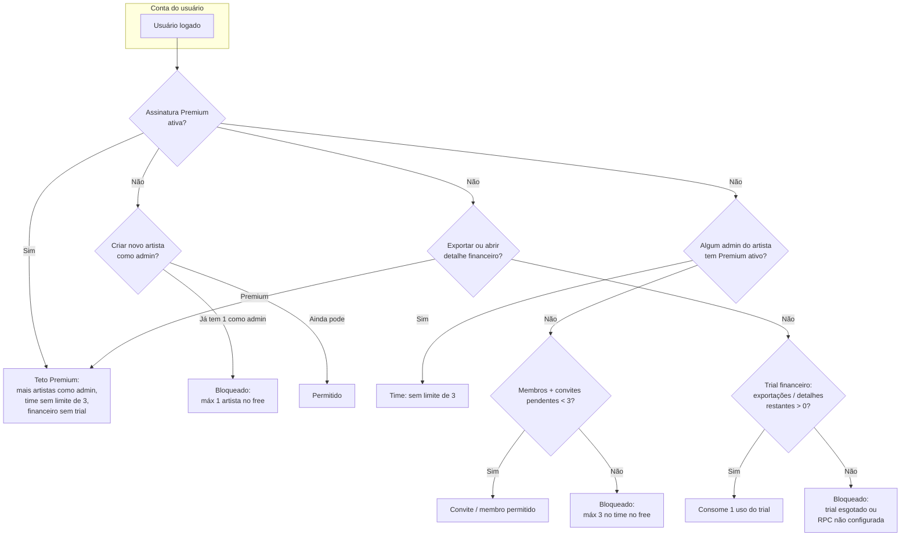

# Limites do plano gratuito vs Premium (Marca AI)

Este documento resume o que o **código e o banco** aplicam hoje. Não existe um “teto global de usuários do app”; os limites são **por conta** (assinatura) e **por artista** (time).

## Tabela comparativa: Free vs Premium

| O que você pode fazer | **Free** (sem assinatura ativa na sua conta) | **Premium** (assinatura ativa na sua conta) |
|------------------------|---------------------------------------------|-----------------------------------------------|
| **Criar perfis de artista como administrador** | Até **1** perfil | **Vários** perfis (sem o limite de 1 do free) |
| **Colaboradores no artista** (membros + convites pendentes que ocupam vaga) | Até **3** pessoas no total (1 admin + até 2 colaboradores) | **Sem o teto de 3** quando **algum admin** daquele artista tem assinatura ativa (em geral: você Premium no seu artista, ou outro admin Premium no mesmo perfil) |
| **Exportar financeiro** (PDF / fluxos que consomem o trial) | **Trial limitado** no servidor (padrão **3** exportações; depois precisa Premium) | **Sem limite** do trial financeiro |
| **Abrir detalhes financeiros** | **Trial limitado** (padrão **3** aberturas; depois precisa Premium) | **Sem limite** do trial financeiro |
| **Agenda, eventos, convites de participação** etc. | Uso conforme o app (sem teto específico implementado igual ao de artistas/time no trecho citado) | Igual; o Premium desbloqueia os limites da tabela, não substitui regras de negócio gerais |

**Legenda rápida**

- **Free** = sua conta **não** tem `user_subscription_is_active` = true.
- **Premium** = sua conta **tem** assinatura ativa em `user_subscriptions` (e RPC equivalente).
- Números **3** (exportações / detalhes) vêm de `database/free_financial_trial.sql` e podem ser alterados no Supabase em `marcaai_financial_trial_settings`.

## “Até quantos usuários é free?”

Interpretação prática:

| O que você quer dizer | No gratuito (sem Premium ativo) |
|------------------------|----------------------------------|
| **Contas no mundo** | Ilimitadas (cada pessoa cria sua conta). |
| **Perfis de artista que EU posso criar como admin** | **1** (`FREE_PLAN_MAX_OWNED_ARTIST_PROFILES` em `services/supabase/userService.ts`). |
| **Pessoas no time de UM artista** (membros + convites pendentes) | **Até 3** no total: **1** admin/dono + **até 2** colaboradores (`FREE_PLAN_MAX_TEAM_MEMBERS_PER_ARTIST`). |
| **Exceção do time** | Se **algum admin** desse artista tiver assinatura ativa (`artistTeamHasPremiumQuota`), o **limite de colaboradores some** para aquele artista. |

Ou seja: no free, pense em **1 artista “seu”** e **time pequeno (3 pessoas)** por artista, salvo quando há Premium no grupo de admins.

## Financeiro (sem Premium)

Além da assinatura, existe **trial financeiro** no servidor (`database/free_financial_trial.sql`), com padrão editável na tabela `marcaai_financial_trial_settings`:

- **Exportações** (PDF / relatório no fluxo que consome o trial): padrão **3** usos por usuário enquanto não for Premium.
- **Aberturas da tela de detalhes financeiros**: padrão **3** usos.

Com **Premium** ativo (`user_subscriptions` / RPC `user_subscription_is_active`), exportações e detalhes financeiros seguem a regra de assinatura (sem esse teto de trial).

## Premium (resumo)

- **Vários perfis de artista** como admin: permitido quando a assinatura do usuário está ativa (`canCreateArtist`).
- **Time / colaboradores**: sem o teto de 3 pessoas **para aquele artista** quando `artistTeamHasPremiumQuota` é verdadeiro (algum admin com assinatura ativa).
- **Financeiro**: sem depender do contador do trial gratuito.

---

## Diagrama (Mermaid)

Fluxo simplificado: “esta ação é free ou precisa de Premium / trial?”

---

## Referências no repositório

| Tema | Onde |
|------|------|
| Limites de artista / time | `services/supabase/userService.ts` — `FREE_PLAN_*`, `assertArtistTeamSlot`, `canCreateArtist`, `artistTeamHasPremiumQuota` |
| Trial financeiro (3+3 padrão) | `database/free_financial_trial.sql`, `get_financial_trial_status` |
| Tela de planos (texto marketing) | `PLANOS_PAGAMENTOS_README.md`, `app/planos-pagamentos.tsx` |

**Nota:** A tela de planos pode descrever benefícios em linguagem de produto; a tabela acima e o diagrama refletem **regras implementadas** no serviço e no SQL do trial.
